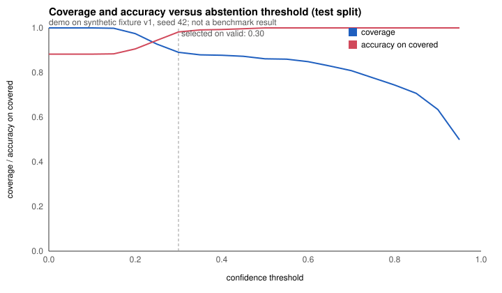

# complaint-intelligence-lab

A customer-experience team receives thousands of complaints and needs to know which themes
are growing and which individual items a person should read. This repository categorises
complaints on the CFPB Consumer Complaint Database schema with a TF-IDF baseline, abstains
on low-confidence items so they can be routed for human review, and evaluates everything
on a chronology-aware, duplicate-aware split.

**Status:** `demo_ready` (runs end to end on authored synthetic fixtures; no real-data
evaluation performed in this repository).

## Problem and user

User: a customer-experience analyst. Question: which complaint themes need attention,
and which items should be routed for human review rather than auto-categorised.

Two facts shape everything here. Complaints are **allegations as submitted**, not
adjudicated findings. And **complaint volume is not a company quality ranking**; it tracks
size, product mix and channel access. The trend flags are prompts to look, never
conclusions, and no company league table is produced.

## Demo

```
make demo
```

runs on the shipped synthetic fixture (4,000 rows, 24 months, seed 42) and writes
`examples/output/`: `metrics.json`, `trends.json`, `topic_landscape.json`, `routing.json`,
`review_log.jsonl`, `portfolio.json`, `predictions_test.csv`, `run_manifest.yaml`, a saved
model, and the three figures in `docs/figures/`.



## Implementation status

Works on the fixture, tested:

- `cfpb/`: schema validation; API client with a dated cache that drops the free-text
  narrative unless explicitly opted in; synthetic fixture generator.
- `pipeline/dedup.py`: exact (normalised SHA-256) and near-duplicate (5-word shingles,
  Jaccard at or above 0.8) grouping with union-find.
- `pipeline/split.py`: chronological train/valid/test with duplicate groups kept on one
  side (first-seen rule), reporting how many rows the rule moved.
- `pipeline/leakage.py`: refuses the target, the child category that encodes it, and the
  post-event fields `company_response`, `timely`, `consumer_disputed`.
- `pipeline/features.py`, `pipeline/model.py`: TF-IDF + one-hot + logistic regression,
  fitted on train only, persisted as numpy/JSON (no pickle).
- `pipeline/abstain.py`: coverage/accuracy curve; threshold chosen on validation only.
- `pipeline/trends.py`: monthly counts by product and issue, recent-vs-baseline ratio flag.
- `pipeline/review.py`: append-only JSONL override log, one audit event per decision.
- `pipeline/sanitize.py`: tag and script removal, escaping, control-character removal,
  length bound, empty-narrative handling.
- `pipeline/summarise.py`: deterministic template summary with cited character spans.
  Adapter interface only; **no language-model provider is wired**.
- `pipeline/landscape.py`: TruncatedSVD 2-D "topic landscape", labelled schematic only.

Proposed, not built: an `issue`-level model evaluated jointly with `product`; drift
monitoring across years; company ablation on real data.

## Quickstart (offline, CPU, under a minute)

```
pip install -e . && pip install pytest
python -m complaint_intelligence_lab smoke      # fixture subset, checks outputs and schema
python -m complaint_intelligence_lab demo       # full fixture, writes examples/output/
python -m pytest -q
```

Other subcommands: `train`, `evaluate --predictions <csv> --threshold <t>`,
`route --input <cfpb-schema csv>`, `figures`, and `fetch` (public API; prints the data-use
notes URL first and refuses to download until `--yes` is passed; never run in CI or tests).

## Data

See [DATA_CARD.md](DATA_CARD.md). No CFPB rows are shipped. The fixture in
`examples/fixtures/v1/` is authored synthetic data with the same column names, fictional
companies (`Demo Bank One`), synthetic IDs (`SYN-CMP-000001`) and template narratives with
no personal data; `FIXTURE.md` states its provenance. To work with real data, read
https://www.consumerfinance.gov/complaint/data-use/ and then run `make fetch`.

## Architecture / method

```
CSV (CFPB schema) -> validate -> sanitise narrative -> dedup groups
   -> chronological split (groups follow earliest member)
   -> leakage guard on feature list
   -> TF-IDF + one-hot (fit on train) -> logistic regression (balanced)
   -> valid: coverage/accuracy curve -> threshold
   -> test: metrics, routing (auto / human_review), simulated review log
   -> trends (month x product x issue), SVD landscape, portfolio JSON
```

Details in [docs/method.md](docs/method.md).

## Train, validate, test

Train on the earliest 60 percent, choose the abstention threshold on the next 20 percent,
report on the latest 20 percent once. Duplicate groups never span splits. A test asserts
that fitted vocabulary and idf do not change when test rows are perturbed.

## Results and provenance

All numbers below were computed by `make demo` on synthetic fixture v1, seed 42, and are
not a benchmark result (evidence label `demo`). Test split, 621 rows.

| Quantity | Value |
|---|---|
| Macro-F1, all test rows | 0.865 |
| Threshold selected on validation (target 0.98 covered accuracy) | 0.30 |
| Coverage on test | 0.890 (68 of 621 routed to human review) |
| Accuracy on covered rows | 0.982 |
| Duplicate groups found / rows in them | 407 / 1,097 |
| Rows moved to keep groups on one side | 365 |
| Theme flagged by the trend rule | Money transfer / Fraud or scam, ratio 3.9 (injected in the fixture) |

The fixture's template narratives make the text signal cleaner than real complaints.
Per-class recall, the confusion matrix (with class order), the coverage/accuracy curve and
disagreement counts are in `examples/output/metrics.json`; the evaluation protocol and the
real test-run summary are in [docs/evaluation.md](docs/evaluation.md).

## Limitations

- Synthetic fixture only; nothing here says how the pipeline performs on real narratives.
- Maximum softmax probability is a weak confidence signal; calibration is not modelled.
- The `company` feature is legitimate at intake but should be ablated on real data.
- The summariser quotes input spans; it does not paraphrase or reason.
- The trend rule is a ratio with a minimum count; it has no seasonality model.

## License and sources

MIT, copyright 2026 Md Sultanul Arefin Sourav. See [NOTICE.md](NOTICE.md). CFPB data
terms apply separately to anything a user downloads with `make fetch`. This is an
`original_project`: it is not attached to a publication or a client engagement.
